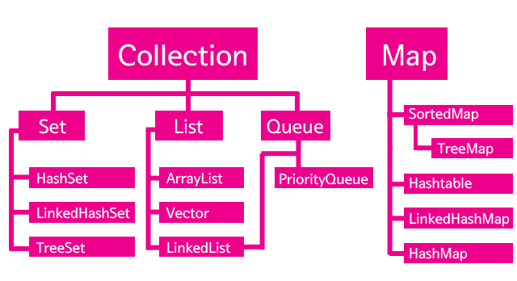

## Collections Framework
- [Collection diagram](https://prashantgaurav1.files.wordpress.com/2013/12/java-util-collection.gif)

### Collections Framework
- 일종의 컨테이너라고도 표현함
- Iterator 는 Collections 인터페이스 안에 정의 되어져 있음. 그렇기 때문에 모든 Collections Framework는 이 메소드를 구현하고 있음을 보장한다.

#### Set
- 중복을 허용하지 않는 데이터 구조(각각의 값은 '고유하다' 라는 의미를 가짐)
- 저장 순서가 유지 되지 않음

#### List
- 개발자가 추가하려는 모든 값들을 Add 할 수 있음(중복을 허용)
- 저장 순서가 유지

#### Map
- 키벨류(Key-Value) 형태의 데이터 구조
- 키는 중복할 수 없지만, 값은 중복 가능

