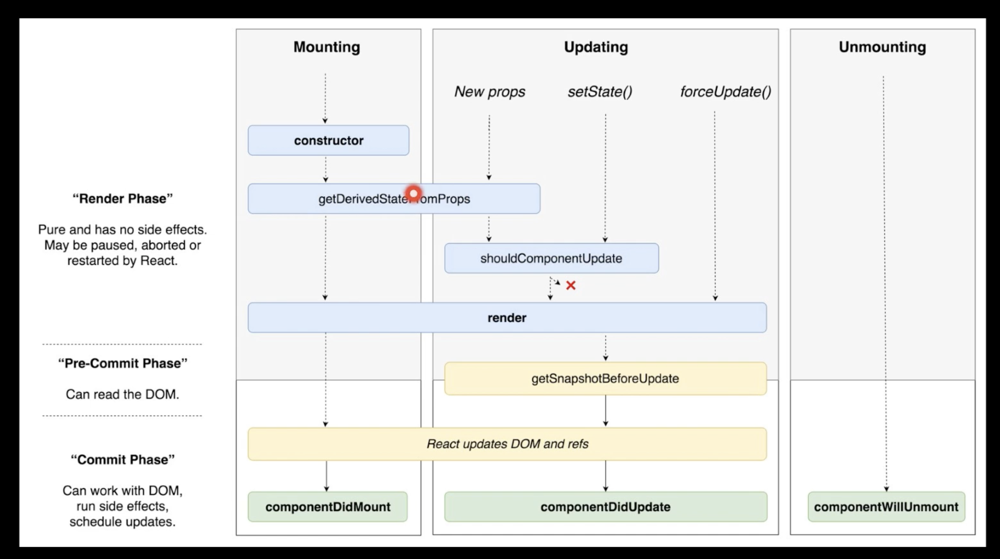

## React Playground

### 생명주기

#### constructor
- 생성자 함수
- 우리가 만든 컴포넌트가 처음 브라우저에 생성될 때, 가장 먼저 실행되는 함수
- 컴포넌트가 가질 state 를 초기화

#### getDerivedStateFromProps
- Props 로 받은 데이터를 state 에 동기화를 시키려할 때 

#### render
- 어떠한 DOM 을 만들지, 내부태그에는 어떠한 값이 들어갈지에 대한 것을 결정하는 함수

#### componentDidMount
- 브라우저상에 DOM 이 나타나게 되면 실행되는 함수
- D3, Chart 라이브러리 와 같은 어떠한 DOM 에 그릴 때 요청하는 훅
- API 를 fetch 할때 사용하는 함수
- 어떠한 DOM 에 이벤트를 바인딩할 때 해당 훅에서 실행 

#### shouldComponentUpdate
- 훅 중에 제일 중요한 훅
- 컴포넌트가 업데이트 되는 성능을 최적화할 때 사용하는 훅
- 부모 컴포넌트가 랜더함수가 실행되면 자식 컴포넌트도 랜더함수가 실행된다.
- 실제 DOM 에 그리는 것이 아니라 vitual dom 에 그리는 것이라 화면에는 따로 보여지지 않음
- 다만 vitual dom 의 성능을 개선하고자 할때 사용하면 좋을 듯
- true/false 에 따라 함수 실행 여부이며, false 이면 render 되지 않음

#### getSnapshotBeforeUpdate
- 랜더 함수 실행 후, 랜더링한 결과물이 브라우저에 반영되기 바로 직전에 실행되는 함수
- 랜더링 후 업데이트 전 스크롤의 위치 혹은 해당 돔의 크기를 가져올때 해당 훅에서 사용함

#### componentDidUpdate
- 브라우저에 랜더링된 직후 실행되는 함수
- 이전의 페이지와 현재의 페이지가 서로 다를 경우 해당 훅에서 특정 작업을 할수있음 

#### componentWillUnmount
- componentDidMount 훅에서 DOM 에 이벤트를 바인딩했을 때 그 이벤트를 해제시켜줄때 해당 훅에서 시켜주면 됨